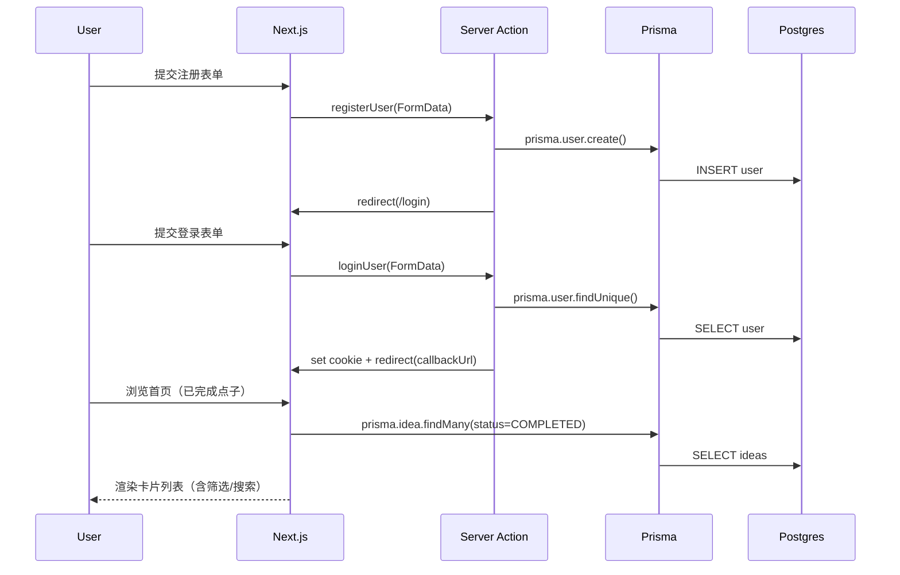
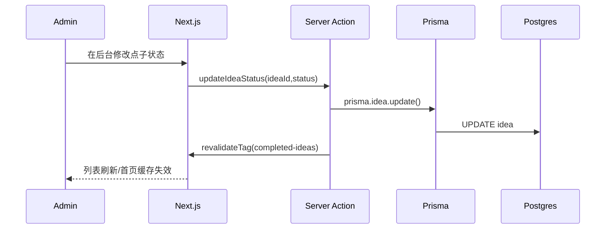

# 架构设计

## 总体架构
```mermaid
flowchart TD
    Browser[Browser] --> Next[Next.js App Router]
    Next --> RSC[Server Components / Server Actions]
    RSC --> Prisma[Prisma Client]
    Prisma --> DB[(Supabase Postgres)]
    Next <-->|Cookie: session (JWT)| Browser
```

## 技术栈
- **应用框架**: Next.js 14（App Router）
- **交互形态**: Server Actions（表单提交）+ Server Components（数据查询）
- **数据访问**: Prisma
- **数据库**: Supabase PostgreSQL
- **认证**: HS256 JWT（`jose`）+ `session` httpOnly Cookie
- **样式**: Tailwind CSS + shadcn/ui

## 核心流程




## 重大架构决策
完整的 ADR 存储在各变更的 `how.md` 中，本章节提供索引。

| adr_id | title | date | status | affected_modules | details |
|--------|-------|------|--------|------------------|---------|
| （暂无） |  |  |  |  |  |

